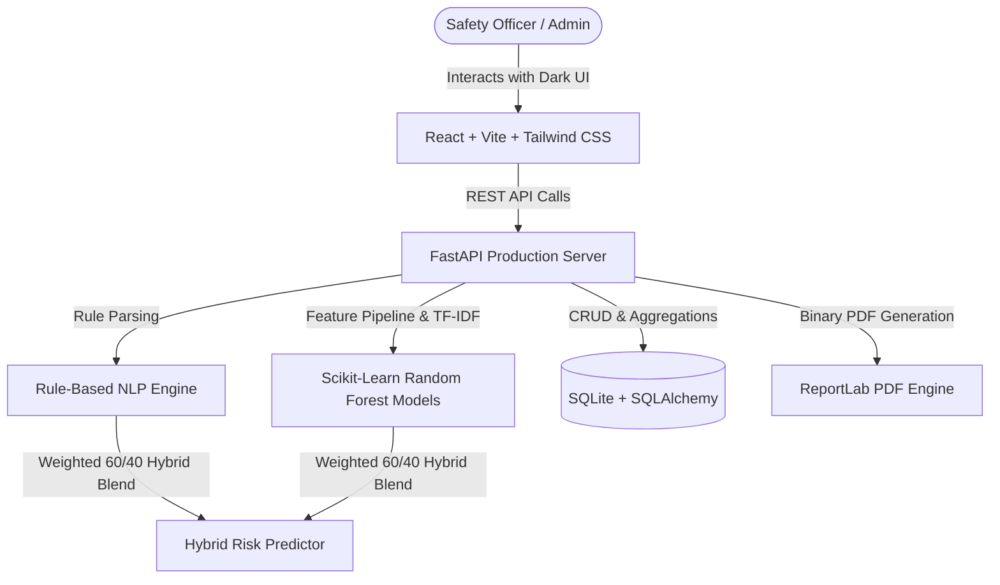

# SafeSense – Hybrid AI Workplace Incident Detection & Response Platform

SafeSense is an intelligent workplace safety intelligence and risk detection platform designed for modern industrial, laboratory, construction, and manufacturing facilities. It combines an **explainable domain rule-based NLP engine** with a **Scikit-Learn Random Forest Machine Learning pipeline** trained on historical and bootstrap incident data to predict risk scores (0–100), classify severity levels, generate tailored response protocols, track incident history, inspect dynamic analytics, and export official PDF risk reports.

---

## 📌 Problem Statement
Workplace safety officers often receive ambiguous or unstructured incident logs. Rapidly categorizing hazards, determining true severity, assessing compound risk factors, and formulating immediate response plans can be slow and inconsistent—increasing the probability of escalation or secondary accidents.

## 💡 The Hybrid AI Solution
SafeSense provides a **Hybrid Decision-Support System**:
- **60% Weight**: Domain safety rule engine evaluating keyword hazards, location risk zones, and worker injury flags.
- **40% Weight**: Machine learning model (RandomForestClassifier & RandomForestRegressor) trained on 1,000+ incident records to learn historical risk patterns.
- **Explainable Rationale**: Itemized point breakdown, probability confidence rating, and transparent rationale.
- **Graceful Fallback**: If ML predictions are unavailable, SafeSense automatically falls back to domain safety rules without crashing.

> **Disclaimer**: SafeSense is a decision-support prototype built for demonstration purposes and is not a certified medical or legal system.

---

## ✨ Hybrid AI Features

- **🧠 Dual-Model Machine Learning Engine (`backend/ml/`)**:
  - `RandomForestClassifier`: Predicts 4-tier severity level (**CRITICAL**, **HIGH**, **MEDIUM**, **LOW**).
  - `RandomForestRegressor`: Predicts risk score (0–100 scale).
  - `TfidfVectorizer` + `ColumnTransformer`: Extracts n-gram text signals from incident descriptions combined with structured attributes (`people_affected`, `injury_reported`, `department`, `category`, `hazard_count`).
  - Model Persistence: Joblib serialized pipelines (`backend/ml/models/`).
- **🔄 Dynamic Retraining Pipeline**:
  - `POST /api/ml/retrain` retrains the model combining real SQLite database logs with synthetic bootstrap data.
  - Generates updated model versions (e.g. `v1.0.1`) and metrics.
- **📊 Real-Time Safety Dashboard & ML Status**:
  - Live AI Model Status card displaying model version, accuracy (90%+), F1 score (0.89+), risk MAE (0.02 pts), record mixture (real vs synthetic), and an interactive **[ Retrain Model ]** button with confirmation modal.
- **🛡️ Incident Analyzer with Hybrid Breakdown**:
  - Displays Rule-Based Base Score vs ML Predicted Score vs Final Blended Score.
  - Multi-hazard tags, hazard list, and model confidence rating.
  - Tailored **Immediate Response** & **Preventive Action** checklists.
  - **Save Incident** button (tags saved incidents as `data_source = 'REAL'`).
- **📈 Advanced Analytics & Feature Importances**:
  - Displays top learned feature importances (e.g., Worker Injury, Chemical Hazard, Rule Base Score).
  - Department comparative safety index, resolution rate, and risk rankings.
- **📄 ReportLab PDF Incident Reports**:
  - One-click binary generation of official PDF Workplace Incident Risk Reports.

---

## 🏗️ Architecture & Technology Stack



### Technology Stack
- **Frontend**: React 18, Vite 5, Tailwind CSS, Recharts, Lucide Icons, React Router DOM v6.
- **Backend**: Python 3.10+, FastAPI, SQLAlchemy ORM, Pydantic v2, ReportLab.
- **Machine Learning**: Scikit-Learn 1.3+, Joblib, Pandas, NumPy.
- **Database**: SQLite (`safesense.db`).

---

## 🧠 Machine Learning Model Metrics

| Metric | Value | Description |
| :--- | :---: | :--- |
| **Severity Accuracy** | **90.0%** | RandomForestClassifier 4-class accuracy |
| **Weighted F1 Score** | **0.898** | Balanced precision & recall evaluation |
| **Risk Score MAE** | **&plusmn;0.02 pts** | Mean absolute error on 0–100 score index |
| **Training Records** | **1,010** | 1,000 synthetic bootstrap + 10 real DB logs |
| **Model Version** | **v1.0.1** | Persisted joblib pipeline |

---

## 🔌 API Endpoints

- `GET  /api/health` - System health check & active ML status.
- `POST /api/auth/login` - Authenticate demo safety user.
- `POST /api/analyze` - Execute hybrid risk analysis (60% Rule + 40% ML).
- `POST /api/incidents` - Save incident to database (tagged `data_source: REAL`).
- `GET  /api/incidents` - Retrieve list of incidents with search & filter params.
- `GET  /api/incidents/{id}` - Fetch single incident detail.
- `PUT  /api/incidents/{id}` - Update incident status.
- `DELETE /api/incidents/{id}` - Delete incident from database.
- `GET  /api/analytics` - Dynamic statistical summary & department metrics.
- `GET  /api/reports/{id}` - Download ReportLab generated PDF report.
- `GET  /api/ml/status` - Returns ML availability, version, record counts, accuracy, F1, MAE.
- `GET  /api/ml/feature-importance` - Returns top learned Random Forest feature importances.
- `POST /api/ml/retrain` - Triggers dataset compilation and model retraining.

---

## 🚀 Quickstart & Local Setup

### 1. Run the FastAPI Backend
```powershell
cd C:\Users\srivathsan\.gemini\antigravity\scratch\safesense
pip install -r requirements.txt
python -m backend.main
```
*Backend API will run at `http://127.0.0.1:8000` (Docs at `http://127.0.0.1:8000/docs`).*

### 2. Run the React Frontend
```powershell
cd C:\Users\srivathsan\.gemini\antigravity\scratch\safesense\frontend
npm install
npm run dev
```
*Frontend application will run at `http://localhost:3000`.*

---

## 🔑 Demo Credentials

- **Email**: `admin@safesense.com`
- **Password**: `admin123`

---

## 💼 Resume / Portfolio Summary

> **SafeSense Project Description**:
> *"Developed a hybrid AI workplace safety platform combining rule-based NLP policies with Scikit-Learn Random Forest machine learning models trained on historical incident data to predict risk scores and severity levels, featuring explainable predictions, feature importance visualizations, and dynamic model retraining as new incident records accumulate."*
