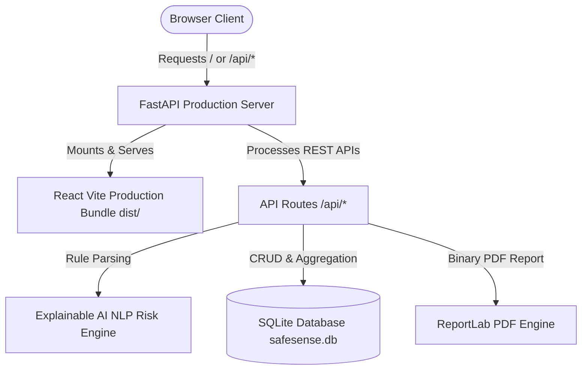

# SafeSense – AI-Powered Workplace Incident Detection & Response Platform

SafeSense is an intelligent workplace safety intelligence and risk detection platform designed for modern industrial, laboratory, construction, and manufacturing facilities. It empowers safety officers to analyze raw incident descriptions using an explainable rule-based AI NLP risk engine, detect multi-hazard vectors, compute normalized risk scores (0–100), classify severity levels, generate tailored response protocols, track incident history, inspect dynamic analytics, and generate official PDF risk reports.

---

## 📌 Problem Statement
Workplace safety officers often receive ambiguous or unstructured incident logs. Rapidly categorizing hazards, determining true severity, assessing compound risk factors, and formulating immediate response plans can be slow and inconsistent—increasing the probability of escalation or secondary accidents.

## 💡 The SafeSense Solution
SafeSense provides an **Explainable AI Decision-Support Workflow** that automatically parses unstructured incident text, calculates a transparent risk score with itemized point contributions, provides clear natural-language rationale, recommends immediate containment and long-term preventive actions, and visualizes site-wide safety intelligence.

> **Disclaimer**: SafeSense is a decision-support prototype built for demonstration purposes and is not a certified medical or legal system.

---

## ✨ Features

- **🛡️ Explainable AI Risk Analysis Engine**:
  - Multi-hazard keyword & entity detection (Chemical, Fire, Electrical, Slip/Fall, Machinery, Trauma, PPE Non-Compliance, Emergency).
  - Weighted risk scoring (0–100 scale) with contextual multipliers (affected personnel count, reported injury, location risk zone).
  - Four-tier severity classification: **CRITICAL** (75–100), **HIGH** (55–74), **MEDIUM** (30–54), **LOW** (0–29).
  - Itemized Risk Factor Impact Matrix explaining *why* the score was assigned.
  - Heuristic Analysis Reliability Indicator (e.g. 87% confidence rating).
- **📊 Real-Time Safety Intelligence Dashboard**:
  - Live KPI cards: Total Incidents, Critical Count, High Risk Count, Resolved Count, Average Risk Score.
  - Interactive Recharts visualizations: 7-Month Incident Trend Line, Severity Distribution Donut, Category Bar Chart, and Recent Incidents table.
- **📜 Incident History Management**:
  - Searchable, filterable data table with instant keyword search.
  - Filter by severity, category, or status.
  - Sort by risk score (highest/lowest first).
  - Dynamic status updating (Pending, Under Investigation, Resolved).
  - Incident deletion with confirmation.
- **📈 Advanced Safety Analytics**:
  - Top 5 Safety Risks & Vulnerabilities ranking.
  - Department safety comparative index.
  - Resolution rate tracking.
- **📄 ReportLab PDF Incident Report Generation**:
  - One-click binary generation of official PDF Workplace Incident Risk Reports.
  - Styled headers, metadata grid, risk gauge summary, rationale text, and itemized action recommendations.
- **🔐 Local & Production Authentication**:
  - Pre-seeded with demo administrator credentials (`admin@safesense.com` / `admin123`).
  - **Safe & Idempotent Database Seeding**: Skips seeding automatically if data already exists in SQLite.

---

## 🏗️ Production Single-Service Architecture



### Technology Stack
- **Frontend**: React 18, Vite 5, Tailwind CSS, Recharts, Lucide Icons, React Router DOM v6.
- **Backend**: Python 3.10+, FastAPI, SQLAlchemy ORM, Pydantic v2, ReportLab.
- **Database**: SQLite (`safesense.db`).

---

## 🧠 AI Risk Engine Algorithm Explanation

The risk engine evaluates incident descriptions across 9 keyword dictionaries and contextual modifiers:

| Hazard Category | Key Signals | Weight Points |
| :--- | :--- | :---: |
| **Fire & Explosion** | `fire`, `smoke`, `flame`, `explosion`, `burning`, `spark` | **+30** |
| **Chemical Hazard** | `chemical`, `toxic`, `acid`, `gas`, `leak`, `spill`, `solvent`, `fumes` | **+25** |
| **Electrical Hazard** | `electric`, `shock`, `wire`, `exposed cable`, `short circuit` | **+25** |
| **Severe Trauma** | `unconscious`, `fracture`, `severe injury`, `heavy bleeding` | **+35** |
| **Physical Injury** | `injured`, `injury`, `bleeding`, `wound`, `hurt` | **+25** |
| **Slip / Fall** | `slip`, `fall`, `ladder`, `height`, `slippery`, `wet floor` | **+20** |
| **Machinery** | `machine`, `conveyor`, `rotating`, `forklift`, `guard failure` | **+20** |
| **PPE Non-Compliance**| `without helmet`, `without gloves`, `no ppe` | **+15** |
| **Multi-Hazard Bonus**| 2 or more distinct hazard categories detected | **+10** |

---

## 🔌 Production Deployment Options

### Option 1: Render Deployment (Render Blueprint)
1. Push code repository to GitHub.
2. In [Render Dashboard](https://dashboard.render.com), click **New +** -> **Blueprint**.
3. Connect your repository. Render will automatically detect `render.yaml` and configure:
   - Build Command: `./build.sh`
   - Start Command: `python -m uvicorn backend.main:app --host 0.0.0.0 --port $PORT`
4. Click **Apply**. Render will build the React SPA, seed database (if empty), and launch the unified server.

### Option 2: Docker Container Deployment
1. Build the multi-stage Docker image:
   ```bash
   docker build -t safesense:latest .
   ```
2. Run the container locally or on any cloud host (AWS ECS, Fly.io, Railway, DigitalOcean):
   ```bash
   docker run -d -p 8000:8000 --name safesense-app safesense:latest
   ```
3. Access application at `http://localhost:8000`.

---

## 🔑 Demo Credentials

- **Email**: `admin@safesense.com`
- **Password**: `admin123`

---

## 🧪 Sample Test Scenarios

Try these input descriptions in the **Incident Analyzer** page:

### Scenario 1: Chemical Leak & Slip Injury
> "A worker slipped near the chemical storage area. A container is leaking and the worker suffered a minor injury."
- **Expected Result**: **CRITICAL** / **HIGH** risk score (~75+), Categories: **Chemical + Slip/Fall**.

### Scenario 2: Electrical Cable Spark
> "An exposed electrical cable produced sparks near the production machine."
- **Expected Result**: **HIGH** risk score (~60+), Categories: **Electrical + Equipment/Machinery**.

### Scenario 3: Electrical Panel Fire
> "A small fire was detected near an electrical panel."
- **Expected Result**: **CRITICAL** risk score (~80+), Categories: **Fire + Electrical**.

### Scenario 4: Wet Floor Slip (No Injury)
> "A worker slipped on a wet floor but no injury was reported."
- **Expected Result**: **MEDIUM** risk score (~35+), Category: **Slip/Fall**.
